# Employee Database Management System

Store, manage and create database of the employees based on their payroll using GUI application.

<br/>

## Table of Contents

<!--ts-->
   * [**Prerequisites**](#prerequisites-1)
   * [**Tech**](#tech-1)
   * [**Documentation**](#documentation-1)
      * [Create Database in MySQL](#create-database-in-mysql-1)
      * [Run/Debug the project](#rundebug-the-project-1)
      * [Create from scratch](#create-from-scratch-1)
      * [Method to input data](#method-to-input-data-1)
      * [Automated fields](#automated-fields-1)
   * [**How to use the project**](#how-to-use-the-project-1)
      * [Total / Add](#total--add-1)
      * [Update](#update-1)
      * [Pay Slip](#pay-slip-1)
      * [Print](#print-1)
      * [Delete](#delete-1)
      * [Search](#search)
      * [Refresh](#refresh-1)
      * [Reset](#reset-1)
      * [Exit](#exit-1)
   * [**Screenshots**](#screenshots)
<!--te-->

<br/>

## Prerequisites
Make sure you have installed all of the following prerequisites on your development machine :

* **Visual Studio 2022** - Download & install Desktop development with C++ and .Net desktop development workloads.

* **.NET Framework 4.8.1 Developer Pack** - The developer pack is used by software developers to create applications that run on .NET Framework, typically using Visual Studio.

* **MySQL Community (GPL)** - Download MSI installer and install full MySQL tools that includes server, shell and workbench.

<br/>

## Tech

* `Visual C++ Winforms`
* `.NET Framework v4.8.1`
* `MySQL Server 8.0`

<br/>

## Documentation

There is a lot of stuff to understand so that you have the application running on the development machine. Following are the steps that explain both general concepts and development process to run the application in debugging mode :

### **Create Database in MySQL**
* Start `MySQL Server 8.0` as localhost (default Port `3306`) with root user using Command Prompt in directory `C:\Program Files\MySQL\MySQL Server 8.0\bin` :
```cmd
mysql -u root -p
```
* Create new schema `employeedb` and execute SQL Script to create a table `employeedb` with the required fields :
```sql
CREATE TABLE `employeedb`.`employeedb` (
  `ID` VARCHAR(10) NOT NULL,
  `Firstname` VARCHAR(50) NOT NULL,
  `Surname` VARCHAR(50) NOT NULL,
  `Address` VARCHAR(200) NOT NULL,
  `Gender` VARCHAR(10) NOT NULL,
  `Mobile` VARCHAR(15) NOT NULL,
  `Weight` INT NOT NULL,
  `Salary` INT NOT NULL,
  `OverTime` INT NOT NULL,
  `OtherPay` INT NOT NULL,
  `Tax` VARCHAR(20) NOT NULL,
  `Pension` VARCHAR(20) NOT NULL,
  `StudLoan` VARCHAR(20) NOT NULL,
  `HIPay` VARCHAR(20) NOT NULL,
  `PayDate` VARCHAR(30) NOT NULL,
  `TaxPeriod` INT NOT NULL,
  `IFSCcode` VARCHAR(45) NOT NULL,
  `AccountNo` VARCHAR(45) NOT NULL,
  `PANCode` VARCHAR(45) NOT NULL,
  `Taxable` VARCHAR(20) NOT NULL,
  `Pensionable` VARCHAR(20) NOT NULL,
  `NetPay` VARCHAR(20) NOT NULL,
  `GrossPay` VARCHAR(20) NOT NULL,
  `Deductions` VARCHAR(20) NOT NULL,
  PRIMARY KEY (`ID`));
```

<br/>

### **Run/Debug the project**
* Clone repository or download directory [CppEmployee](CppEmployee/) and open [CppEmployee.sln](CppEmployee/CppEmployee.sln) using Visual Studio.
* Run project using `Local Windows Debugger`.


<br/>

### **Create from scratch**
* Create a new project in Visual Studio with template `CLR Empty Project (.NET Framework)`.
* Configure your new project with project name `CppEmployee` and select `.NET Framework 4.8.1`.
* Open project properties. On the dialog box that appears, in the Configuration Properties, set Linker as follows :
   - **System** - set SubSystem to `Windows(/SUBSYSTEM:WINDOWS)`.
   - **Advanced** - in the Entry Point type `Main`.
* Verify Configuration Manager is set for `Debug x64` for both active solution and project.
* Apply changes to the dialog.
* Add new item to the project. On the dialog box that appears, in the Visual C++ select UI and add Windows Forms with default name `MyForm.h`.
* Replace `MyForm.cpp` in project with the [`MyForm.cpp`](CppEmployee/MyForm.cpp) file available in repository.
* Debug or run the project with `Local Windows Debugger`. Close the windows dialog and restart the project.
* Add reference to the project, `MySql.Data.dll`.
* Replace `MyForm.h` in project with the [`MyForm.h`](CppEmployee/MyForm.h) file available in repository.
* Now debug/run the project to view the final build.

<br/>

### **Method to input data**
The user has to input data in the following fields only :

| Field | Description |
| :---: | :---: |
| Firstname | First name of the employee |
| Surname | Last name of the employee |
| Address | Residence address of the employee |
| Gender | Gender of the employee |
| Mobile | Contact number of employee |
| City Weight | City allowance offered by the organization |
| Basic Salary | The core of the salary received by an employee. |
| Over Time | Overtime allowance offered by the organization |
| Other Payment | Bonus or other additional amount |
| Paydate | The date on which salary is credited to employee |
| Tax period | Period for which Tax is required to be paid. |
| IFSC code | Salary account IFSC code |
| Account No | Salary account number |
| PAN Code | PAN code of the employee |
| Search | Search an employee using Firstname |

<br/>

### **Automated fields**
Following  text fields are calculated automatically by the application when the user clicks on `Total/Add` button to create a new tuple and store the data :

| Field | Description |
| :---: | :---: |
| Ref No | Random unique number to store an entity |
| Tax | `9% of (City allowance + Basic Salary + Over Time)` |
| Pension | `12% of (City allowance + Basic Salary + Over Time)` |
| Student Loan | `5% of (City allowance + Basic Salary + Over Time)` |
| Health Insurance (HI) Payment | `3% of (City allowance + Basic Salary + Over Time)` |
| Taxable Pay | `Taxable Pay = Tax Period` |
| Pensionable Pay | `Pension * Tax period` |
| Gross Pay | `City allowance + Basic Salary + Over Time + Other Payent` |
| Deductions | `Tax + Pension + Student Loan + HI Payment` |
| Net Pay | `Gross Pay - Deductions` |

<br/>

## How to use the project
The functionalities of the project are explained below :

### **Total / Add**
To create a new entity into database, fill the [required input fields](#method-to-input-data-1) and press `Total/Add` button. The remaining empty fields are automated.
<!-- gif -->
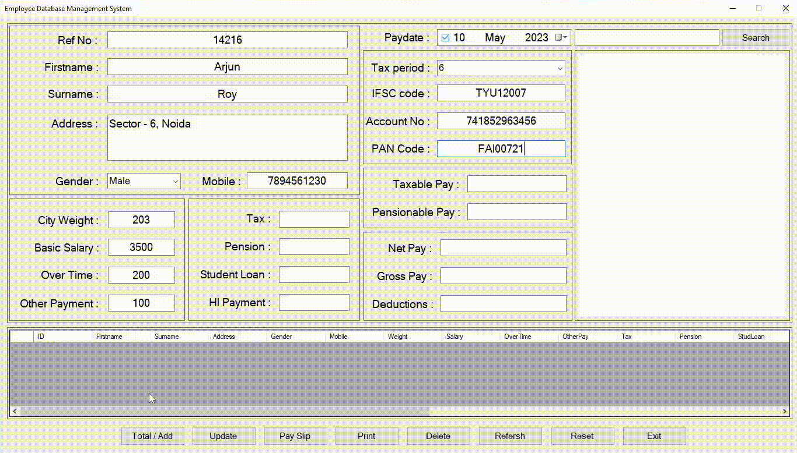

<br/>

### **Update**
The user can modify any cell data by selecting a tuple from data grid to view data in fields then make modifications in textbox and press `Update` button.
<!-- gif -->
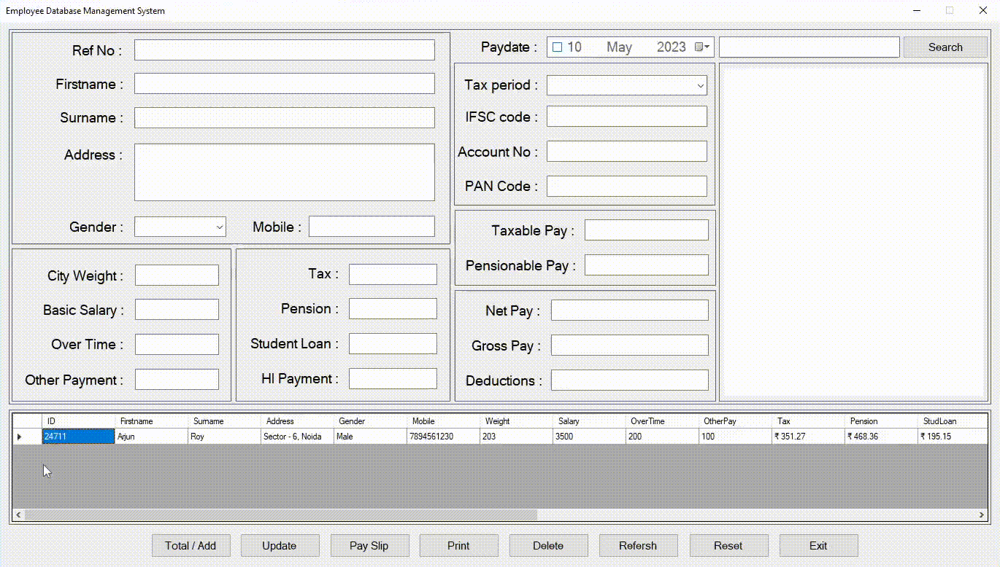

<br/>

### **Pay Slip**
Rich textbox is where detailing of the pay amount given is concluded, inlcuding all the tax and insurance deducted. The user can make any corrections in the pay slip at this moment.
<!-- gif -->
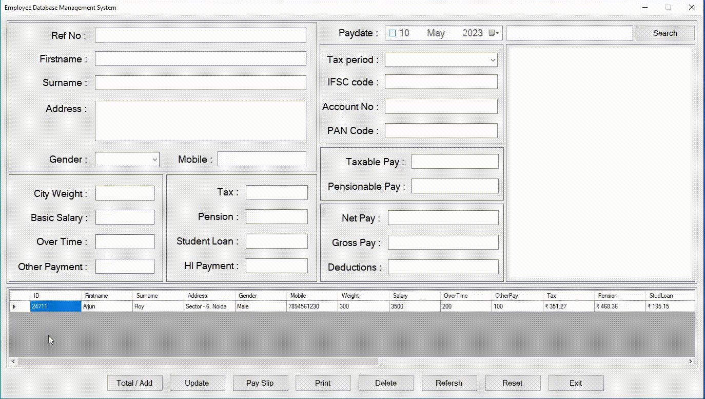

<br/>

### **Print**
Create a pdf or print the pay slip using `Print` button. The dialog box will pop-up to preview the final document.
<!-- gif -->
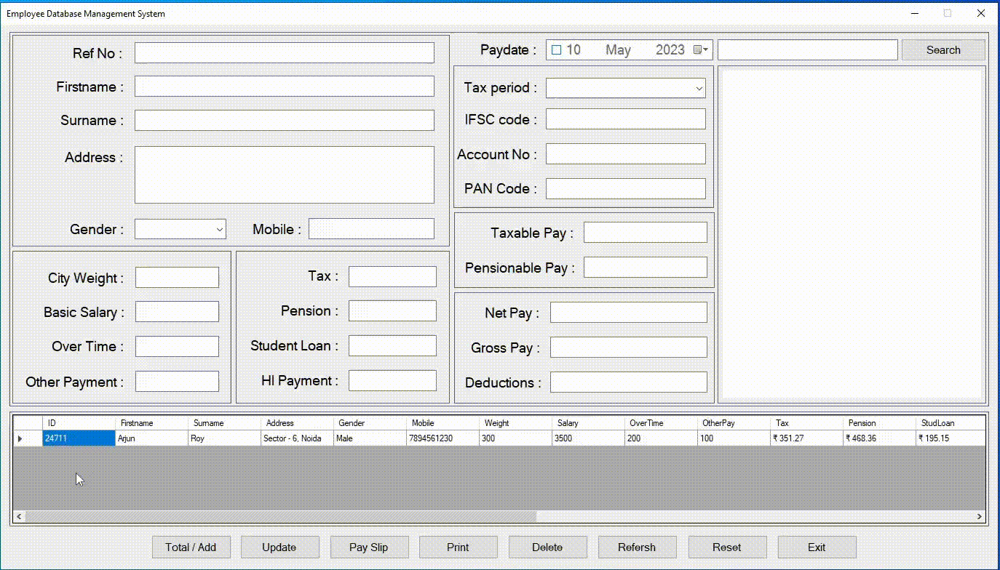

<br/>

### **Delete**
Select a tuple from data grid and press `Delete` to remove that employee from the database.
<!-- gif -->
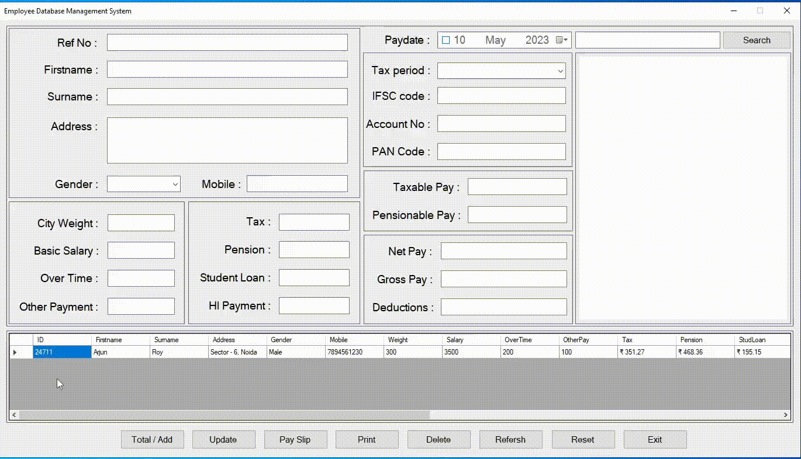

<br/>

### **Search**
Find the employee using firstname. Press `Search` to display data of employee in the data grid.
<!-- gif -->
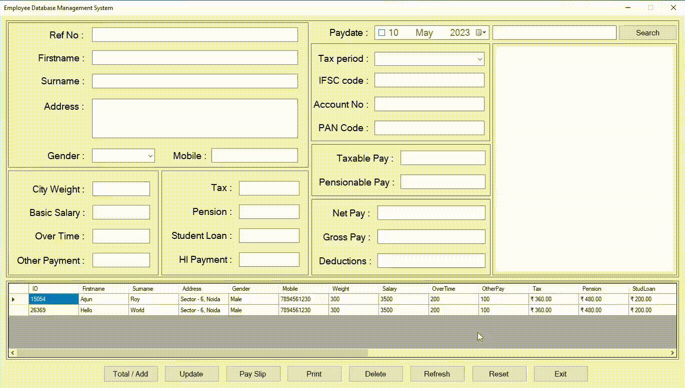

<br/>

### **Refresh**
Press `Refresh` to view all the entities after any modifications or changes in database. After search press this button to set data grid to default state.
<!-- gif -->
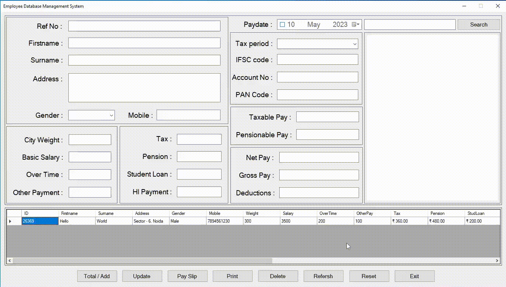

<br/>

### **Reset**
To empty all textboxes of the form at once, press `Reset`.
<!-- gif -->
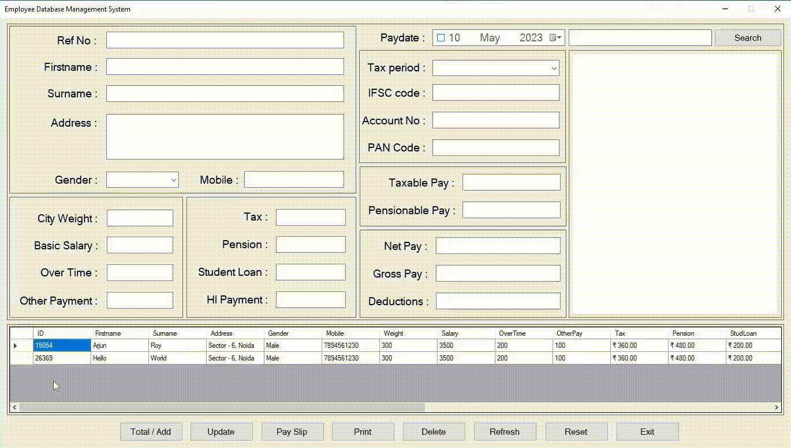

<br/>

### **Exit**
Dailog asks for confirmation to close the application on `Exit`.
<!-- gif -->
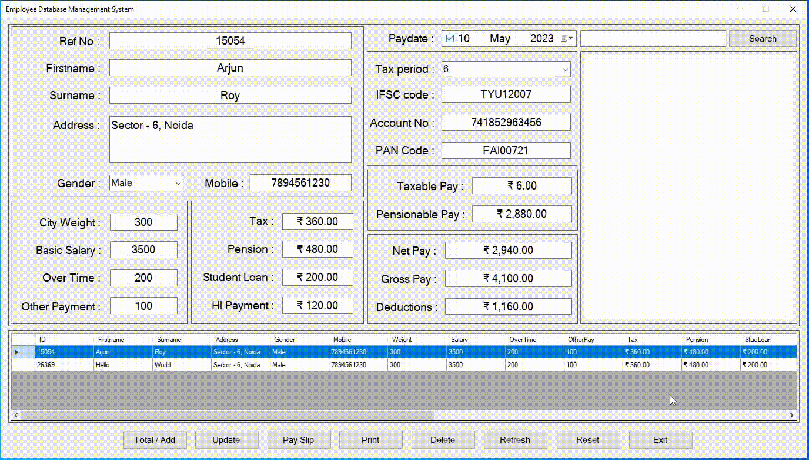

<br/>

## Screenshots

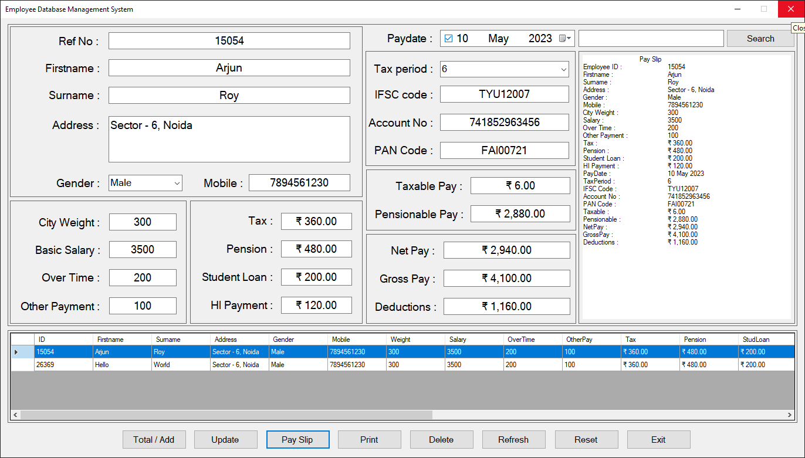

<br />

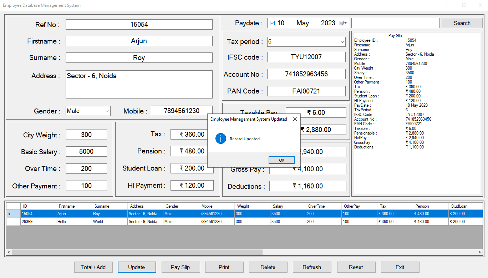